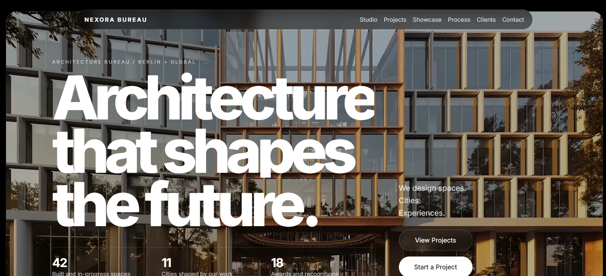

# Nexora Architecture Bureau

A premium architecture studio portfolio website built with plain HTML, CSS, and JavaScript.

## Overview

This project is a cinematic one-page portfolio for an architecture bureau. It combines a video-led hero, refined editorial layouts, smooth GSAP motion, and a Three.js showcase to create a high-end presentation for architecture clients.

## Highlights

- Fullscreen video hero using the local `Videos/Video1.mp4`
- Premium dark visual system with rounded framed sections
- GSAP + ScrollTrigger reveals, parallax, and horizontal process motion
- Three.js wireframe studio scene
- Three.js immersive project showcase with hover details
- Responsive featured projects, client wall, awards, and contact section
- GitHub Pages deployment workflow included

## Stack

- HTML
- CSS
- JavaScript
- [GSAP](https://gsap.com/)
- [Three.js](https://threejs.org/)

## Local Preview

Open `index.html` directly in your browser, or serve the folder locally with a simple static server.

Example with Node:

```bash
npx serve .
```

## Live Demo

[View Live Demo](https://azzalachraf.github.io/nexora-architecture/)

## Screenshot

Desktop preview:



## Project Structure

```text
.
|-- .github/
|   `-- workflows/
|       `-- deploy-pages.yml
|-- screenshots/
|-- Videos/
|   `-- Video1.mp4
|-- index.html
`-- README.md
```

## Deployment

This repo includes a GitHub Actions workflow that deploys the static site to GitHub Pages on every push to `main`.

## Credits

- Background video: local project asset
- Project imagery: remote architecture images loaded from Unsplash
- Social logos: web-hosted PNG assets
